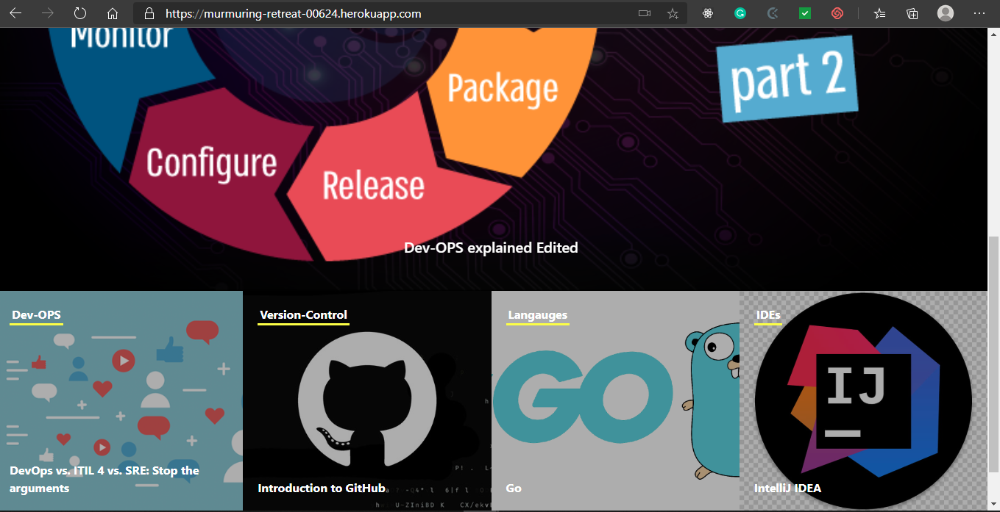
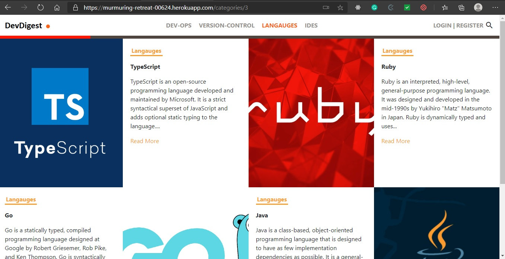

# Dev-Digest

For my rails capstone project, I created a website app for developer related articles.




Additional description about the project and its features.

## Built With

- Ruby v2.6.5
- Ruby on Rails v6.0.3.3
- HTML5, CSS3, JS

## Live Demo

[Live Demo Link](https://murmuring-retreat-00624.herokuapp.com/)

## Getting Started

To get a local copy up and running follow these simple example steps.

### Prerequisites

- Ruby: >= 2.6.0
- Rails: >= 6.0
- Postgres: >=9.5

### Setup

```
$ git clone https://github.com/asiimwedismas/dev-digest.git
$ cd dev-digest
$ yarn install --check-files
```

### Install

Install gems with:

```
$ bundle install
```

Setup database with:

```
$ rails db:create
$ rails db:migrate
```

### Usage

Start server with:

```
$ rails server
```

Open `http://localhost:3000/` in your browser.

### Run tests

```
$ bundle exec rspec --format documentation
```

## Authors

👤 **Dismas Asiimwe**

- Github: [@asiimwedismas](https://github.com/asiimwedismas)
- Linkedin: [@asiimwedismas](https://www.linkedin.com/in/asiimwedismas/)
- Twitter: [@asiimwedismas](https://www.twitter.com/asiimwedismas)

## 🤝 Contributing

Contributions, issues, and feature requests are welcome!

## Show your support

Give a ⭐️ if you like this project!

## Acknowledgments

- Hat tip to anyone whose code was used
- Inspiration
- etc

## 📝 License

[Creative Commons license of the design](https://creativecommons.org/licenses/by-nc/4.0/)
